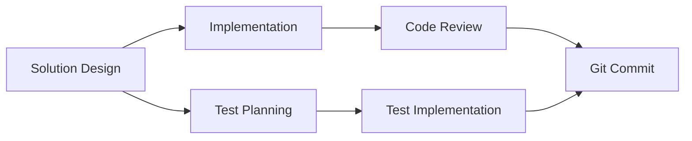

# Roadmap d'Optimisation du Système de Délégation

## Vision: Passer de 40% d'inefficacité à <10% en 3 mois

### Baseline Actuel (Septembre 2025)
- **Efficacité globale**: 60%
- **Taux première résolution**: 53%
- **Overhead moyen**: 5.3 min/délégation
- **ROI global**: 0.8x (perte nette)

### Cible T+3 mois
- **Efficacité globale**: 90%
- **Taux première résolution**: 75%
- **Overhead moyen**: 2.5 min/délégation
- **ROI global**: 1.6x (gain net)

---

## Phase 1: Quick Wins (Semaines 1-2)
**Objectif**: +20% efficacité immédiate

### Actions

#### 1.1 Rotation des Agents Sous-Utilisés
**Quoi**: Utiliser junior-developer et code-quality-analyst en priorité
```
Changement:
- Avant: developer par défaut (30% du trafic)
- Après: junior-developer pour tâches <1h, code-quality pour revues

Impact attendu: -15% répétitions
Métrique: Taux répétition junior < 35%
```

#### 1.2 Limite de Répétitions Hard-Coded
**Quoi**: Max 2 tentatives avant escalade automatique
```python
if repetition_count >= 2:
    escalate_to_specialist()

Impact: Éviter les 18 répétitions TypeScript
Économie: ~20h/mois
```

#### 1.3 Checklist Pré-Délégation
```markdown
□ Tâche > 15 minutes?
□ Nécessite expertise spécifique?
□ Contexte suffisant pour prompt?
□ Success criteria clairs?

Si < 2 "oui" → Ne pas déléguer
```

### Métriques Semaine 2
- [ ] Taux utilisation developer < 25%
- [ ] Zero répétition > 3x
- [ ] 20% réduction délégations totales

---

## Phase 2: Optimisation Structurelle (Semaines 3-6)
**Objectif**: +25% efficacité, infrastructure de feedback

### Actions

#### 2.1 Templates Structurés par Agent

**Template Developer**:
```markdown
CONTEXTE: [Projet/Module]
PROBLÈME: [Description spécifique]
SOLUTION TENTÉE: [Si applicable]
CONTRAINTES: [Performance/Compatibilité]
SUCCESS CRITERIA: [Tests passent/Compile/etc]
```

**Template Solution-Architect**:
```markdown
BESOIN BUSINESS: [Requirement]
CONTRAINTES TECHNIQUES: [Stack/Limits]
PATTERNS À ÉVITER: [Anti-patterns connus]
LIVRABLES ATTENDUS: [Design/Diagramme/ADR]
```

#### 2.2 Matrice de Décision Agent × Tâche

| Type Tâche | Agent Primaire | Agent Fallback | Never Use |
|------------|---------------|----------------|-----------|
| Bug simple (<30min) | junior-developer | developer | senior-developer |
| Bug complexe | developer | senior-developer | general-purpose |
| Code review | code-quality-analyst | architecture-reviewer | developer |
| Refactoring | refactoring-specialist | architecture-reviewer | junior-developer |
| Tests | integration-specialist | developer | documentation-writer |
| Architecture | solution-architect | architecture-reviewer | junior-developer |
| Git operations | git-workflow-manager | - | developer |

#### 2.3 Système de Feedback Automatisé

```python
class DelegationTracker:
    def __init__(self):
        self.history = {}

    def record_delegation(self, agent, task_type, success, time_taken):
        # Enregistrer pour apprentissage

    def suggest_agent(self, task_type):
        # Basé sur historique succès
        return best_agent_for_task

    def alert_inefficiency(self):
        # Si répétition ou session longue
        send_alert()
```

### Métriques Semaine 6
- [ ] 80% délégations utilisent templates
- [ ] Taux première résolution > 65%
- [ ] Temps moyen résolution -30%

---

## Phase 3: Parallélisation et Automatisation (Semaines 7-10)
**Objectif**: +15% efficacité via parallélisation

### Actions

#### 3.1 Identification Tâches Parallélisables

**Parallel Workflows**:


**Configuration**:
```json
{
  "parallel_eligible": {
    "documentation": ["any_phase"],
    "tests": ["after_initial_implementation"],
    "performance_analysis": ["after_features_complete"]
  }
}
```

#### 3.2 Orchestrateur Intelligent

```python
class SmartOrchestrator:
    def analyze_dependencies(self, tasks):
        # Identifier tâches indépendantes

    def dispatch_parallel(self, independent_tasks):
        # Lancer en parallèle

    def wait_and_merge(self, results):
        # Consolider résultats
```

#### 3.3 Cache de Résolutions

```python
resolution_cache = {
    "typescript_config_error": "Check tsconfig.json paths",
    "merge_conflict_pattern": "Use rebase strategy",
    "test_timeout": "Increase jest timeout"
}

def check_cache_before_delegation(error_pattern):
    if match in resolution_cache:
        return cached_solution
```

### Métriques Semaine 10
- [ ] 30% tâches exécutées en parallèle
- [ ] Cache hit rate > 15%
- [ ] Réduction 40% temps cycle complet

---

## Phase 4: Intelligence et Apprentissage (Semaines 11-12)
**Objectif**: Système auto-améliorant

### Actions

#### 4.1 ML pour Sélection d'Agents

```python
from sklearn.ensemble import RandomForestClassifier

class AgentSelector:
    def __init__(self):
        self.model = RandomForestClassifier()

    def train_on_history(self, historical_data):
        # Features: task_type, complexity, time_of_day, etc
        # Target: best_agent
        self.model.fit(X, y)

    def predict_best_agent(self, task_features):
        return self.model.predict(task_features)
```

#### 4.2 Détection Anomalies

```python
class AnomalyDetector:
    def detect_inefficiency_patterns(self):
        # Identifier patterns inhabituels
        # Ex: spike répétitions, sessions anormalement longues

    def suggest_intervention(self):
        # Recommander action corrective
```

#### 4.3 Rapports Hebdomadaires Automatisés

```markdown
## Rapport Efficacité Semaine X

### Top Performers
1. Agent A: 95% first-try success
2. Agent B: 2.1 min temps moyen

### Problèmes Détectés
- Pattern X répété 5 fois → Suggestion: [Action]
- Agent Y sous-performant sur [Type Tâche]

### Optimisations Suggérées
- Migrer 20% trafic de [Agent Sur-utilisé] vers [Agent Sous-utilisé]
- Paralléliser [Workflow Identifié]
```

### Métriques Semaine 12
- [ ] ROI global > 1.5x
- [ ] Efficacité système > 85%
- [ ] Prédiction agent correcte > 80%

---

## Métriques de Suivi Continue

### Dashboard Temps Réel

```
┌─────────────────────────────────────┐
│ EFFICACITÉ SYSTÈME                  │
├─────────────────────────────────────┤
│ ▓▓▓▓▓▓▓▓░░ 76% (+12% vs last week) │
├─────────────────────────────────────┤
│ Délégations/jour: 32 (-20%)        │
│ Taux résolution: 71% (+8%)         │
│ Overhead moyen: 3.2 min (-39%)     │
├─────────────────────────────────────┤
│ ALERTES                             │
│ ⚠️ Session 12ab3: 12 délégations    │
│ ⚠️ Developer: 3 répétitions task X  │
└─────────────────────────────────────┘
```

### KPIs Hebdomadaires
1. **Efficacité**: (Tâches complétées / Délégations) × 100
2. **ROI**: Temps économisé / Temps investi
3. **Quality Score**: (First-try success × 0.6) + (Temps respect × 0.4)

### Seuils d'Alerte
- Répétition > 2 → Alerte immédiate
- Session > 10 délégations → Warning
- ROI jour < 0.8 → Review urgente
- Queue agent > 5 → Rebalancing nécessaire

---

## Budget et ROI Projeté

### Investissement
- Phase 1-2: 20h développement
- Phase 3-4: 40h développement
- Maintenance: 5h/mois

### Gains Projetés
- Mois 1: +40h productivité
- Mois 2: +80h productivité
- Mois 3: +120h productivité
- **ROI 3 mois**: 4x investissement

### Break-even
- Atteint en semaine 4
- ROI positif continu après

---

## Risques et Mitigations

| Risque | Probabilité | Impact | Mitigation |
|--------|-------------|--------|------------|
| Résistance au changement | Moyenne | Fort | Formation progressive, quick wins visibles |
| Complexité technique | Faible | Moyen | Implémentation incrémentale |
| Faux positifs alertes | Moyenne | Faible | Tuning progressif des seuils |
| Overhead monitoring | Faible | Faible | Sampling, pas tracking exhaustif |

---

## Success Criteria Finaux

### T+3 mois, succès si:
- [ ] Efficacité globale ≥ 85%
- [ ] ROI système ≥ 1.5x
- [ ] Satisfaction utilisateur ≥ 4/5
- [ ] Réduction 50% sessions marathon
- [ ] Zero répétition > 3x même tâche
- [ ] 100h/mois productivité gagnée

### Go/No-Go Decision Points
- **Semaine 2**: Quick wins validés → Continuer Phase 2
- **Semaine 6**: ROI > 1.0 → Continuer Phase 3
- **Semaine 10**: Efficacité > 75% → Lancer Phase 4

---

## Annexe: Scripts de Migration

### Script 1: Analyse Historical Data
```bash
#!/bin/bash
# Analyser patterns historiques pour baseline
python analyze_delegation_history.py \
  --input /delegation_logs \
  --output baseline_metrics.json
```

### Script 2: Deploy Templates
```bash
#!/bin/bash
# Déployer templates dans système
for agent in developer architect reviewer; do
  cp templates/${agent}_template.md /agents/templates/
done
```

### Script 3: Monitor Real-Time
```python
# monitor.py
import time
from delegation_tracker import DelegationTracker

tracker = DelegationTracker()
while True:
    metrics = tracker.get_current_metrics()
    if metrics.needs_alert():
        send_notification(metrics.alert_message)
    time.sleep(60)
```

Cette roadmap transformera le système de délégation d'un coût en un multiplicateur de productivité.